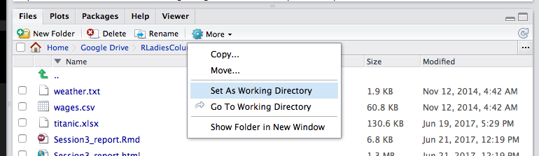
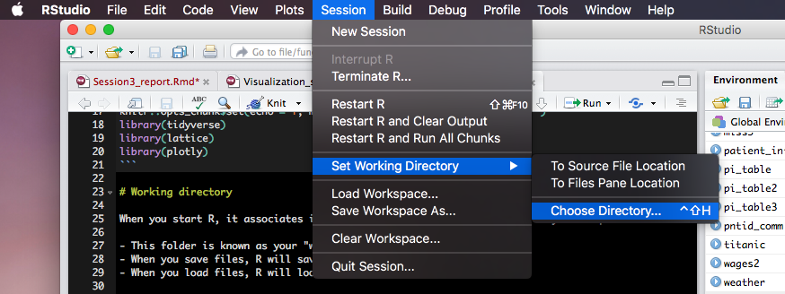
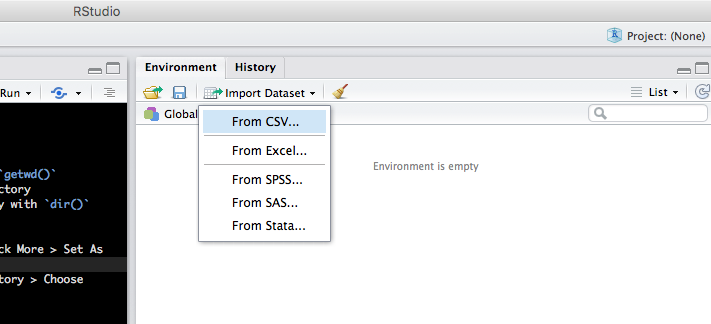
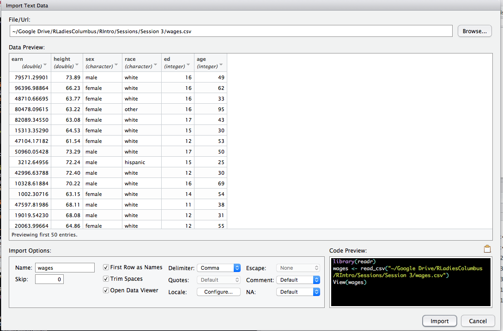
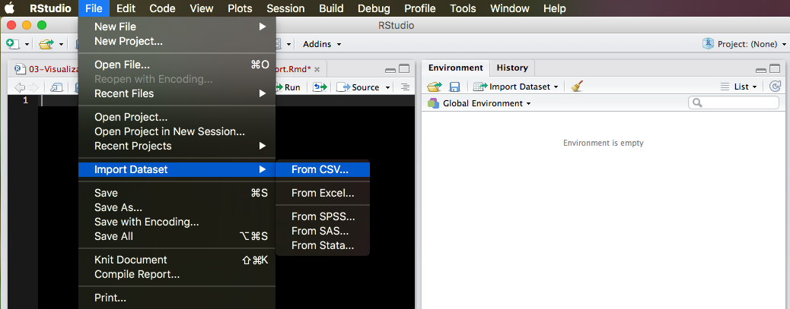
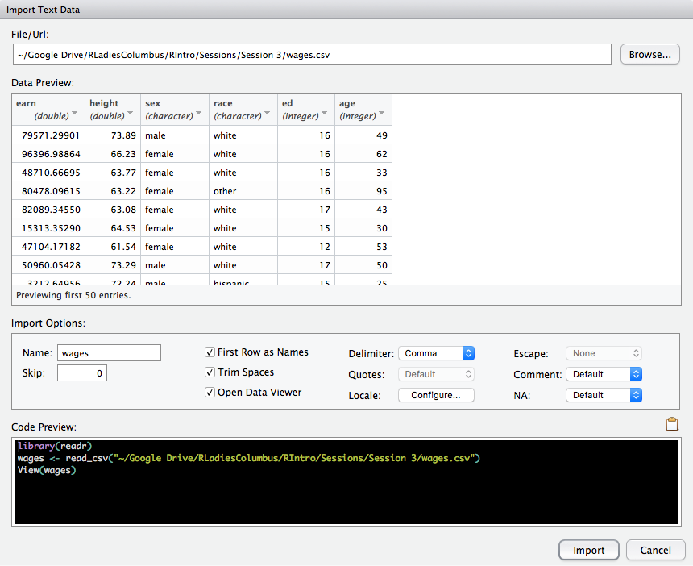

```{r setup, include=FALSE}
knitr::opts_chunk$set(echo = T, message=F, eval=T, fig.align = "center", cache = FALSE)
library(tidyverse)
library(lattice)
library(plotly)

### IMPORTANT !!! ###
# change the path to your directory
# setwd("~/Google Drive/RLadiesColumbus/RIntro/Sessions/Session 2/")
```

# First things first   

Most issues with loading data in R comes from:   

   
1. Not knowing/understanding the file type.   
2. Not using the appropriate function to read in the data. 
3. Providing an incorrect path to the file. 

- Solution to incorrect path is either giving the **full path** to the file or knowing your **working directory**.

# Working directory

When you start R, it associates itself with a folder (i.e, directory) on your computer.    

- This folder is known as your "working directory"    
- When you save files, R will save them here    
- When you load files, R will look for them here    

 
- **See the current working directory**
- You can print the path of your current working directory by running `getwd()`
- The files pane of RStudio displays the contents of your working directory
- You can also print the the contents of your current working directory with `dir()`
 
#  Change the working directory
> - **First option:** Navigate in the files pane to a new directory. Click More > Set As Working Directory    



> - **Second option:** In the toolbar, go to Session > Set Working Directory > Choose Directory...  


> - **Third option:** Change on your script. This option allows you to keep track of the working directory you are working in.  Go
 
```{r, eval=F}
# this is for Mac/Linux
setwd("~/change/this/path/to your/Session 3 folder path") 

# this is for windows
setwd("C:/change/this/path/to your/Session 3 folder path") # note / instead of \ in windows 
```


# A much better way to keep track of your working directory - Using R Projects

Let's go to [R for Data Science Book: Workflow: projects](https://r4ds.had.co.nz/workflow-projects.html)    


R Projects also work seamlessly with Git, the version control software.  

To read more about how to get started with Git go to [happygitwithr.com](https://happygitwithr.com/).    

If you already know how to use Git but want to know how to use it with R Projects jump to that chapter [happygitwithr.com/rstudio-git-github](https://happygitwithr.com/rstudio-git-github.html)

# Your turn {.bigger}

> - Create a new project for this session's folder.     

> - **Note:** If you downloaded this folder, then it came as a .zip archive. You must extract the .zip file before you can use it as a directory.    

> - You can unzip folders with R as well!

For example:

```{r, eval=FALSE}
unzip("Session4-20190501T150706Z-001.zip")
```

But make sure the path to your zip file is correct!


# Reading files into R
You need to "load" your data in the R environment to be able work with it. You also need to assign it to a variable to save the data in your R environment. Otherwise you will only print it to your console. When importing your data you need to know:   

 1. **Path of your file.** Where is this file located in your computer? 
  If the file is already in your working directory `"./filename"` or ``"filename"` will be sufficient. Note that you can also go one directoty up with `"../"` or down with `"./sub folder name/filename"`. Or you can give the main path to your file.
 
 2. **File type.** What type of file is this? Is it txt, csv, xls? 
  Usually the file extension would give you the hint. R has a variety of packages and functions to read specific file types. If the extension of your file seems unusual and you cannot open the file with a text editor, or when opened the file doesn't seem to be human readable, look at online resources to find the appropriate R package or function to read that file in.  

 3. **Delimiter of the file.** What character defines the column separation? Comma? Semicolon? Tab? Space (white space)? Or something else? **This is very important!** If the same delimiter character appears in one of the cells, R will try to separate that as a column and having unequal number of columns in different rows will cause problems.
 
 
 4. **Does your file have a header?** By default `read.table()` function will assume that your data set does not have a header. You need to change the argument to `header=T` if your data has a header. You should also make sure you do not have special characters in your column names. `tidyver
 
# Reading files into R: **First option:**     
Go to Environment pane, Import Dataset > Choose file type > Browse > Make your adjustments > Import







# Reading files into R: **Second option:**    

In the toolbar, go to File > Import Dataset > Choose file type > Browse > Make your adjustments > Import   






# Reading files into R: **Third option:**   

Read file on your script/console. For this option you need to know the file type and the separator of that file to use the correct function. The **most generalized** function to read data is `read.table()`. You always need to assign the output of this function to a variable, otherwise you will not be able to load your data in your R environment
 
**Example:** Load `weather.txt`     
This text file is separated by tab and has a header. Also I want the columns with strings to be the character class, and not the factor class.  Run the `read.table()` function without assigning to a variable. What happens? 

```{r}
weather <- read.table("data/weather.txt", # path to file
                      sep="\t",        # delimiter set to tab
                      header = T,      # file has header, T is same as TRUE
                      stringsAsFactors = F) # set strings as character
head(weather, 3) # show first 3 rows
```

It seems like `weather` isn't a very clean data set and has many missing data points shown with `.`, which should be `NA`. Although, I can replace those `.`s with `NA`s while I'm cleaning the data, wouldn't it be nice to just replace them `NA` when reading the data in? Well I can easily do that with `na.strings` argument!

```{r}
weather <- read.table("data/weather.txt", # path to file
                      sep="\t",        # delimiter set to tab
                      header = T,      # file has header, T is same as TRUE
                      stringsAsFactors = F, # set strings as character
                      na.strings = ".") # periods are missing values, read them as NA !
head(weather, 3) # show first 3 rows
```

# Reading files into R: `tidyverse` way

All the base R functions to load data in R are also available through `tidyverse` via `readr` package for most data types. There is also `readxl` package for importing excel sheets and `haven` package for SPSS, Stata and SAS files.

`read_delim()` is the generalized function for `tidyverse` way.

**Example:** Load `weather.txt`

```{r}
weather <- read_delim("data/weather.txt", delim = "\t", na = c(".", "NA"))
head(weather, 3)
```

But if you already know what file type you are importing, you can also choose the appropriate functions for that type.

**Example:** Load `weather.txt`

Since `weather.txt` is a tab separated file, I can simply use `read_tsv()` function.

```{r}
weather <- read_tsv("data/weather.txt", na = c(".", "NA"))
head(weather, 3)
```


**Example:** Load `wages.csv`     

This text file is separated by comma and has a header. `
Similarly, for this type of file I can simply use `read_csv()` function.

```{r}
wages <- read_csv("data/wages.csv") 
head(wages, 3)
```

# More options to read data in R    

There are many other packages that provide other functions that let you read your data in your R environment.     
Here some examples:     
       
1. **`data.table` package:** Provides the fastest function to read data: `fread()` function. Best way to deal with very large datasets (500 MB and larger). It will import data in a "data.table" format, but don't worry it's still the same old "data.frame" object that we learned. `data.table` library also provides other functions and objects to manipulate data. However it has a cryptic syntax, making it less friendly to learn.  

1. **`readxl` package:** The readxl package makes it easy to get data out of Excel and into R.    

1. **`haven` package:** Read SPSS, Stata and SAS files into R.    

1. To read more about all of this go to [R for Data Science Book: Import Data](https://r4ds.had.co.nz/data-import.html)    

1. Further details on working with databases and connecting them in R go to [db.rstudio.com](https://db.rstudio.com/)


# **Your turn:**  (5 mins) {.bigger}
 1. Check `?read_delim` help file. What are the other base R functions that read specific types of data? What about the arguments and the default settings?      
 
 2. Load `crime.csv` using `read_delim()` or `read_csv()` and assign it to variable `crime`.     
 3. What is the mean murder rate in the US according to `crime` data?    
 
 4. Load the first sheet of `titanic.xlsx` using the `read_excel()` function from `readxl` library.
 
 5. In total how many females perished in titanic? 


