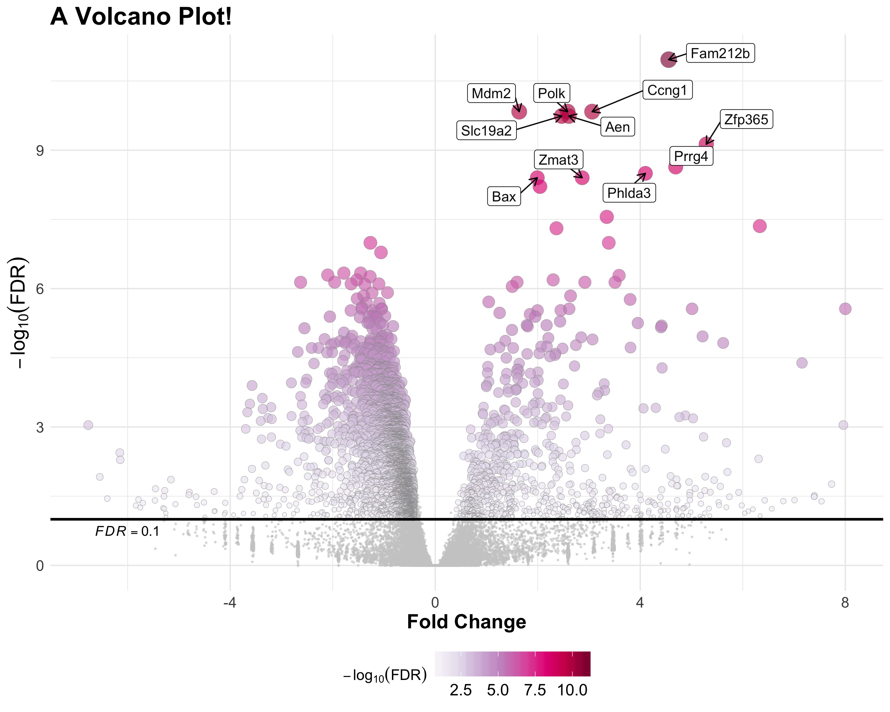

```{r setup, include=FALSE}
knitr::opts_chunk$set(echo = T, message=F, eval=T, warning = FALSE,
                      cache = TRUE,
                      fig.align = "center", fig.path = "figures/")
```

# Setup

Today we'll need the following **R** libraries, if you get an error, make sure you have all of them installed with `install.packages()` function.

```{r}
library(tidyverse)
library(RColorBrewer) # to create color scales
library(ggrepel)      # to crate nice labels for gene names
library(scales)       # to look at color we created
```

# Creating a customized volcano plot

Last lecture we looked at point plots and how to plot them based on data.    
Today we will look at a customized *volcano plot* like the one below:


       
       
**What is a volcano plot?**       
A [volcano plot](https://en.wikipedia.org/wiki/Volcano_plot_(statistics)) is a type of scatter-plot that is used to quickly identify changes in large data sets composed of replicate data. It plots significance versus fold-change on the y and x axes, respectively. These plots are increasingly common in omic experiments such as genomics, proteomics, and metabolomics where one often has a list of many thousands of replicate data points (e.g. genes, proteins, metabolites) between two conditions (e.g. normal vs sick) and one wishes to quickly identify the most meaningful changes. In this example we're looking gene expression (process that converts sequence of a gene in the DNA to messenger RNA).

## Dataset for the volcano plot

Dataset we'll use comes from an experiment where mice were exposed to x-ray (this is also used as a treatment to kill cancer cells) . Then messenger RNA (mRNA) levels were measured from ~27,000 genes in spleen tissue in both control and exposed mice. The table below shows the **results** from a statistical test comparing these two groups across ~27,000 genes. Conducting the same comparison test with 27,00 genes leads to (*multiple comparison (testing) problem*)[https://en.wikipedia.org/wiki/Multiple_comparisons_problem]. To overcome this problem and detect the true positives, multiple testing correction was applied to the results, which gives the false discovery rate (FDR).

```{r}
genes.Spleen.Xray <- read_csv("data/results_miceSpleen_xray.csv")
head(genes.Spleen.Xray)
```

This data format is already in appropriate format for our plotting purposes.   

We will only add columns:    
- `logFDR`: Negative $log_{10}$ transformed FDR (false discovery rate) values     
- `threshold`: defining whether a gene qualifies for the set threshold. In this case, it is any gene that satisfies:      
    - $FDR < 0.1$ (which is also same as $logFDR > 1$) and $|\ logFC\ | > 0.4$
         

We will also pick the top 10 genes and assign as a separate data frame for labels in the plot.

```{r}
pdat <- genes.Spleen.Xray %>%
  mutate(logFDR = -log10(FDR),
         threshold = ifelse(FDR < 0.1 & abs(logFC) > .4, TRUE, FALSE) )

#subset top 10 genes to add labels later to our plot
data.label <- pdat %>%
  filter(threshold == TRUE) %>%
  top_n(n = 10, wt = logFDR)
data.label
```


## `geom_point` layers

In the plot **any point below our threshold** has different aesthetics mapped to them!!
Therefore, we will add **two layers** of `geom_point` and provide different datasets and aesthetic mappings to each layer.    
        
One of the differences between these two layers is the shape of the point.         
        
**Plotting ‘character’ (`pch`)**
There are multiple shapes available for plotting points.
Take a look with:
```{r}
?pch
```


       
Back to our plot...

```{r}
vp <- ggplot(pdat, aes(x = logFC, y = logFDR)) +
  geom_point(data = filter(pdat, threshold == FALSE),
             size=.35, alpha = .55, colour = "grey80") +
  geom_point(data = filter(pdat, threshold == TRUE),
             aes(size = logFDR, fill=logFDR),
             pch = 21, stroke = .25, alpha = .65, color = "grey59")
vp
```

## Let's talk about colors

```{r}
?brewer_pal
brewer.pal(6, "PuRd")
display.brewer.pal(6, "PuRd")


myPallete <- colorRampPalette(brewer.pal(8,"PuRd"))
myPallete(10)

show_col(myPallete(10))
show_col(myPallete(100), labels = FALSE)
```

## Customize color scales, legend & axes labels and plot title

```{r}
vp <- vp +
  scale_fill_gradientn(guide="colourbar", colours = myPallete(100)) +
  guides(size=FALSE,
         color=FALSE,
         fill=guide_colourbar(title = expression(-log[10](FDR)))) +
  labs(x = "Fold Change",
       y = expression(-log[10](FDR))) +
  geom_hline(yintercept=1, color="black", size=1) +
  annotate(geom = "text", x=-6, y=0.75, label="italic(FDR) == 0.1",parse=TRUE) +
    ggtitle("A Volcano Plot!")

vp
```

## Add labels for top 10 genes

```{r}
vp <- vp  +
  geom_label_repel(data = data.label,
                   aes(label = GENE), alpha = .95,
                   size = 4, color = "black",
                   box.padding = 0.5, segment.size = .5,
                   arrow = arrow(length = unit(0.015, 'npc')))


vp
```

## Make **cosmetic** changes with `theme()`

```{r}
vp <- vp  +
  theme_minimal() +
  theme(plot.title = element_text(lineheight = 1,face = "bold",size = 20),
           axis.text = element_text(size = 12),
           axis.title = element_text(size = 16, face = "bold"),
           legend.text=element_text(size=13),
           legend.position="bottom",
           legend.title = element_text(size = 12,face = "bold"),
           legend.key.size = unit(0.035, "npc"),
           strip.text.x = element_text(size = 16, colour = "black"),
           strip.text.y = element_text(size = 16, colour = "black"))

vp
```

## Save plot

Default is PDF format but many graphic devices are available.

```{r, eval=FALSE}
?ggsave

ggsave( "volcano_plot.pdf",
        vp, width = 10, height = 8)

ggsave( "volcano_plot.jpeg",
        vp, width = 10, height = 8, device = "jpeg")

```

# Other plot types

## `mpg` data

`ggplot2` dataset, you need to first load `tidyverse` or `ggplot2`

Fuel economy data from 1999 and 2008 for 38 popular models of car

```{r}
?mpg
head(mpg,3)
mpg$class[1:20]
```

## Barplots

`geom_bar` is designed to make it easy to create bar charts that show **counts**.
For example number of cars in each class
```{r}
ggplot(mpg, aes(manufacturer)) +
  geom_bar() +
    theme(axis.text.x = element_text(size = 10, angle = 45))
```

### Stacked

To plot sub categories in each group, use `aes(fill = x)` function.
This will let you color the bars.
Bar charts are automatically stacked when multiple bars are "defined"" at the same location.

```{r}
ggplot(mpg, aes(manufacturer)) +
 geom_bar(aes(fill = class)) +
  theme(axis.text.x = element_text(size = 10, angle = 45))
```

### Side by side

To have side by side plots for the groups you would like to compare, you need to use the `position` argument within the `geom_` functions. You can either simply assign the name of positioning as a string or assign a `position_` function for more details.

```{r}
ggplot(mpg, aes(manufacturer)) +
 geom_bar(aes(fill = class), position = "dodge")

ggplot(mpg, aes(manufacturer)) +
  geom_bar(aes(fill = class),position = position_dodge(width = 0.4))
```

## Visualizing data points or mean as barplot

Plotting mean or other statistics of a variable directly with `ggplot2` is less straightforward.
One way is to use `stat_summary_bin` function.

```{r}
?stat_summary_bin

ggplot(mpg, aes(class)) +
  stat_summary(aes(y = displ), fun.y = "mean", geom = "bar")

```

A more straightforward approach is to use `geom_col`.

### `geom_col` function

If you would like to plot means or any other values other than the count of categories you need to provide them to `ggplot()` in the following format:

Assuming that outcome is the mean outcome of treatments (`trt`) `a`, `b` and `c` here.
```{r}
df <- data.frame(trt = c("a", "b", "c"), outcome = c(2.3, 1.9, 3.2))
df
```

Then use `geom_col()`

```{r}
ggplot(df, aes(trt, outcome)) +
  geom_col()
```

You can also change colors easily

```{r}
ggplot(df, aes(trt, outcome)) +
  geom_col(fill="steelblue")

```

```{r}
ggplot(df, aes(trt, outcome)) +
  geom_col(aes(fill=trt))
```

Another nice trick is to take advantage of `group_by` and `summarise` functions.

```{r}
mpg %>%
  group_by(class) %>%
  summarise(cty_mean = mean(cty)) %>%
  ungroup() %>%
  ggplot(aes(class, cty_mean)) +
  geom_col()

```

## `geom_bar()` with continuous data

You can use geom_bar() with continuous data, in which case it will values and show counts at unique locations. (But `geom_histogram` is more appropriate for this task.)

```{r}
ggplot(mpg, aes(displ)) + geom_bar()
```

# Histograms

Histograms are basically barplots with "bins".
To construct a histogram,

1. "bin" the range of values. What is meant by "binning" is, to divide the entire range of values into a series of intervals.
2. Then count how many values fall into each interval.

The bins are usually specified as consecutive, non-overlapping intervals of a variable.

```{r}
ggplot(iris, aes(Sepal.Length)) + geom_histogram(binwidth = 0.2)
```

```{r}
ggplot(iris, aes(Sepal.Length, fill=Species)) +
  geom_histogram(binwidth = 0.5)
```

```{r}
ggplot(iris, aes(Sepal.Length, fill=Species)) +
  geom_histogram(binwidth = 0.5, alpha=0.4)
```

```{r}
ggplot(iris, aes(Sepal.Length, fill=Species)) +
  geom_histogram(binwidth = 0.5, position = "identity", alpha=0.4)
```


# Boxplots

A box plot is a easy way to get some overall idea about the distribution of your variable. Let's have a quick review on how to read a box plot:


## Example `ToothGrowth` dataset

```{r}
head(ToothGrowth)
?ToothGrowth
```

Here's how the the distribution of tooth length for different regimens look like.

```{r}
gb <- ToothGrowth %>%
      unite(regimen, -len, sep= "_") %>%
      ggplot(data=., aes(regimen, len)) +
      geom_boxplot(aes(color=regimen))
```

# Plotting means and error bars

The error bars can define multiple *types of variation*:

1. **Standard deviation (`sd`)** shows how much each data point deviate from the mean "on average". This is useful if you would like to have a general idea about how the data is distributed.

2. **Standard error of the mean (`sem`)** gives a value explaining how much your estimated mean is affected by the sampling variability.

3. **95% Confidence interval (`ci95`)** the interval which you are 95% certain that the true mean (or any estimated value/statistic) falls into. This is probably the best *type of variation* if we are really interested in estimating the mean.

- Go to this [cute article](http://blog.minitab.com/blog/statistics-and-quality-data-analysis/variations-on-a-theme-of-variation-r-v-sd-se-and-ci) for better a explanation.


As mentioned earlier, `ggplot2` it's easier to provide calculated summary statistics for plotting, rather than using the `stats_` functions.

So, now let's compute the `mean`, `sd` and `se` using `summarise` function.

## Compute stats for `ToothGrowth`

```{r}
tg.stats <- ToothGrowth %>%
  group_by(supp, dose) %>% # group by
  summarise(.,
            mean.len = mean(len),  # mean
            sd.len = sd(len),      # sd
            n = length(len)        # count
            ) %>% 
  ungroup() %>%
  mutate(se.len = sd.len/sqrt(n))

```

Now this is how `tg.stats` look
```{r}
tg.stats
```

Finally we can start plotting!
Let's start with line graphs.

## Point and Line graphs

Step by step:

### 1. Just plot mean tooth length as data points

For points, `shape` is the same as `pch`.

```{r}
ggplot(tg.stats, aes(x=dose, y=mean.len, colour=supp)) +
    geom_point(aes(x=dose, y= mean.len), size=4, shape=18)
```


### 2. Add the error bars: Show standard deviation

```{r}
ggplot(tg.stats, aes(x=dose, y=mean.len, colour=supp)) +
  geom_point(aes(x=dose, y= mean.len), size=4, shape=18) +
  geom_errorbar(aes(ymin=mean.len-sd.len, ymax=mean.len+sd.len), width=.1)
```

### 3. Add lines

```{r}
ggplot(tg.stats, aes(x=dose, y=mean.len, colour=supp)) +
  geom_point(aes(x=dose, y= mean.len), size=4, shape=18) +
  geom_errorbar(aes(ymin=mean.len-sd.len, ymax=mean.len+sd.len), width=.1) +
  geom_line()
```

### 4. Add original data points

Just specify the original data set in another layer of `geom_plot`. Just like the volcano plot!

```{r}
ggplot(tg.stats, aes(x=dose, y=mean.len, colour=supp)) +
  geom_point(aes(x=dose, y= mean.len), size=4, shape=18) +
  geom_errorbar(aes(ymin=mean.len-sd.len, ymax=mean.len+sd.len), width=.1) +
  geom_line() +
  # here I add the original data points!
  geom_point(data=ToothGrowth, aes(x=dose, y=len, fill=supp), alpha=0.4, size=1.5)
```

Now that we have more or less the plot we want, let's customize it further.

# Customizing graphs

## 1. Change titles and set scale limits

Modify axis, legend, and plot labels see [Reference ggplot2: Scale](http://ggplot2.tidyverse.org/reference/index.html#section-scales)

```{r}
ggplot(tg.stats, aes(x=dose, y=mean.len, colour=supp)) +
  geom_point(aes(x=dose, y= mean.len), size=4, shape=18) +
  geom_errorbar(aes(ymin=mean.len-sd.len, ymax=mean.len+sd.len), width=.1) +
  geom_line() +
  geom_point(data=ToothGrowth, aes(x=dose, y=len, fill=supp), alpha=0.3, size=1.5) +

# Here I add the titles I want
  labs(x="Supplement Dose",
       y="Tooth Length",
       title= "The Effect of Vitamin C on Tooth Growth in Guinea Pigs",
       subtitle= "Comparing delivery methods: Orange Juice vs Ascorbic Acid",
       caption = "Based on the data from R")
```

Define the limits of axes

```{r}
ggplot(tg.stats, aes(x=dose, y=mean.len, colour=supp)) +
  geom_point(aes(x=dose, y= mean.len), size=4, shape=18) +
  geom_errorbar(aes(ymin=mean.len-sd.len, ymax=mean.len+sd.len), width=.1) +
  geom_line() +
  geom_point(data=ToothGrowth, aes(x=dose, y=len, fill=supp), alpha=0.3, size=1.5) +

# Here I add the titles I want
  labs(x="Supplement Dose",
       y="Tooth Length",
       title= "The Effect of Vitamin C on Tooth Growth in Guinea Pigs",
       subtitle= "Comparing delivery methods: Orange Juice vs Ascorbic Acid",
       caption = "Based on the data from R") +

# Change x and y axes limits
  xlim(0, 3) +
  ylim(0, 60)
```


## 2. Change legend title

We saw in the previous session how to change legend parameters with `guides()` function. To change the legend title we can use the same function. See (Reference ggplot2 Guides)[http://ggplot2.tidyverse.org/reference/index.html#section-guides-axes-and-legends]

```{r}
ggplot(tg.stats, aes(x=dose, y=mean.len, colour=supp)) +
  geom_point(aes(x=dose, y= mean.len), size=4, shape=18) +
  geom_errorbar(aes(ymin=mean.len-sd.len, ymax=mean.len+sd.len), width=.1) +
  geom_line() +
  geom_point(data=ToothGrowth, aes(x=dose, y=len, fill=supp), alpha=0.3, size=1.5) +

# Here I add the titles I want
  labs(x="Supplement Dose",
       y="Tooth Length",
       title= "The Effect of Vitamin C on Tooth Growth in Guinea Pigs",
       subtitle= "Comparing delivery methods: Orange Juice vs Ascorbic Acid",
       caption = "Based on the data from R") +

# Change the legend
  guides(colour=guide_legend("Supplement"), fill=guide_legend("Supplement"))
```

## 3. Jitter points

I want to customize the `jitter` of the points. To adjust positions look at [position adjustment in ggplot2 Reference](http://ggplot2.tidyverse.org/reference/index.html#section-layer-position-adjustment)

```{r}
pd <- position_dodge(0.1)

# my plot is getting very long, I'll assign it
tgp <- ggplot(tg.stats, aes(x=dose, y=mean.len, colour=supp)) +
  geom_point(aes(x=dose, y= mean.len), size=4, shape=18, position=pd) +
  geom_errorbar(aes(ymin=mean.len-sd.len, ymax=mean.len+sd.len), width=.1, position=pd) +
  geom_line(position=pd) +
  geom_point(data=ToothGrowth, aes(x=dose, y=len, fill=supp), alpha=0.3, size=1.5, position=pd) +


# Here I add the titles I want
  labs(x="Supplement Dose",
       y="Tooth Length",
       title= "The Effect of Vitamin C on Tooth Growth in Guinea Pigs",
       subtitle= "Comparing delivery methods: Orange Juice vs Ascorbic Acid",
       caption = "Based on the data from R") +

# Change the legend
  guides(colour=guide_legend("Supplement"), fill=guide_legend("Supplement"))

tgp
```

# Bonus: Plotting Time

The dataset we'll use contains the daily closing prices of major European stock indices: Germany DAX (Ibis), Switzerland SMI, France CAC, and UK FTSE. Be aware that this is a slightly modified version of the `EuStockMarkets` a dataset that comes with R and the dates in the data was simulated by me and doesn't represent the actual dates. But it already comes in a friendly date format, so when we import it, R will already now that this columns is in date format.

```{r}
euStock <- read_csv("data/EUstock_1992-1997.csv")
head(euStock)
```

As we already know, this dataset can be cleaner. We would rather have all the stock indices listed under one column for plotting.

```{r}
euStock <- euStock %>%
  gather(Stock, Closing, -date) 
head(euStock)
```

This looks much better!    
    
Now let's plot it!     

```{r}
p <- euStock %>%
ggplot(aes(x=date, y=Closing, color = Stock)) +
  geom_line()
p
```


## Customize Time Format

Now we can decide which date format we want to use for plotting.
The table below explains how to provide the date format. Click [here](https://www.statmethods.net/input/dates.html) for more details.


Here some examples:

```{r}
p+scale_x_date(date_labels = "%b")
p+scale_x_date(date_labels = "%Y %b %d")
p+scale_x_date(date_labels = "%m-%Y")
```

## Customize Time Scale

To see the x-axis, let's angle out x-axis tick labels so we can see them clearly.

```{r}
p<- p + theme(axis.text.x=element_text(angle=60, hjust=1, size=8))

p + scale_x_date(date_breaks = "1 month", date_labels = "%b")
p + scale_x_date(date_breaks = "3 month", date_labels = "%b %y")
p + scale_x_date(date_breaks = "3 month", date_labels = "%b %y",
                 date_minor_breaks = "2 week") 
```

## Limit Time Scale

You can also plot a specific period by giving a range with first and last date of the period.

```{r, warning=FALSE}
p + scale_x_date(limit=c(as.Date("1994-01-01"),as.Date("1996-01-31")))
```


